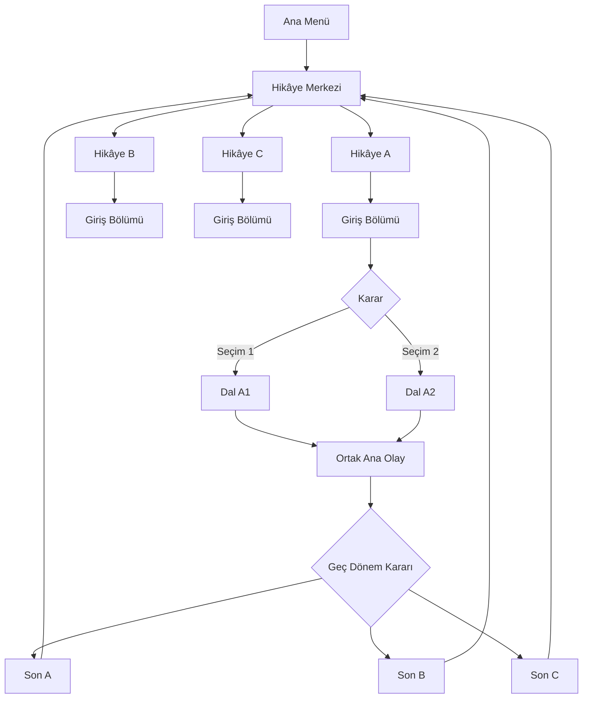
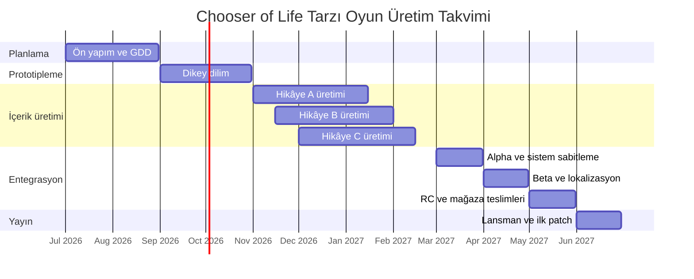

# Chooser of Life Tarzı Oyun İçin Kapsamlı Oyun Tasarım Dokümanı

## Yönetici özeti

Bu rapor, resmi mağaza sayfalarında “Choice of Life” adıyla görülen; kart/sahne tabanlı, seçim odaklı, çoklu sonlu, metin ağırlıklı yaşam simülasyonu ve etkileşimli hikâye çizgisini referans alan bir “Chooser of Life” tarzı oyun için ayrıntılı bir GDD önerir. Resmî tanımlarda seri; kararların kaderi ve hikâyenin yönünü belirlediği, kart tabanlı seçim mekaniği kullanan, çoklu sonlar sunan bir görsel roman/metin RPG/life sim hibriti olarak çerçeveleniyor. Ayrıca serinin en yeni mobil örneklerinden birinde Türkçe dil desteğinin 18 Mayıs 2026 tarihinde eklenmiş olması, bu alt türde Türkçe yerelleştirmenin pratik ve güncel bir örnek hâline geldiğini gösteriyor. citeturn15view0turn15view1turn15view2

Önerilen ürün vizyonu şudur: oyuncu, tek bir uygulama içinde birden fazla bağımsız hikâye arasından seçim yapar; her hikâye, kısa ama yoğun karar düğümlerinden oluşur; her düğüm görünür ve gizli durum değişkenlerini etkiler; sonuçlar anlık, gecikmeli ve son-etkili biçimde geri döner; oyuncu oturum sonunda bir sona ulaşır, ardından aynı hikâyeyi başka bir rota ile yeniden oynayabilir ya da farklı bir hikâyeye geçebilir. Bu yaklaşım, türün temelini oluşturan “okuma, karar verme, sonuç görme, yeniden deneme” döngüsünü bozmadan yalnızca kullanıcı tarafından açıkça talep edilen bir genişleme olarak “oyun içinden seçilebilen birden fazla hikâye” özelliğini ekler. Seri örneklerinin hem PC hem de mobilde yayınlanması ve Türkiye oyun pazarının 2025 sonunda 1,01 milyar dolar düzeyine ulaşması, Türkçe öncelikli ve çok platformlu bir tasarımın iş gerekçesini güçlendirir. citeturn15view0turn15view1turn20view3

Bu GDD’nin temel tasarım kararı, her hikâyede “tam dallanan ağaç” yerine “branch-and-bottleneck” omurgası kullanmaktır. Bunun nedeni üretim maliyetini kontrol altında tutmak, ancak oyuncunun kararlarını anlamsızlaştırmamak için güçlü durum takibiyle dalların etkisini sonraki düğümlerde yaşatmaktır. Sam Kabo Ashwell’in choice-based oyun yapıları için tanımladığı branch-and-bottleneck kalıbı tam da bu dengeyi, yani ayırt edici rota hissi ile yönetilebilir kapsamı birlikte sunar; Christy Tucker da aynı yapının karmaşıklığı kontrol etmek için kullanıldığını ve tam “time cave” modelinin çok hızlı biçimde içerik patlamasına yol açtığını gösterir. Emily Short ve Failbetter Games’in storylet/QBN açıklamaları ise kısa, koşullu sahne parçalarının birden fazla kısa hikâyeyi ilginç biçimde birleştirebildiğini vurgular; bu da çoklu hikâye seçimi olan bir oyun için içerik üretim mantığı sağlar. citeturn23view0turn23view2turn20view0turn20view1

Teknik açıdan birincil öneri, **Unity + Ink** kombinasyonudur; nedeni çok platformlu build akışı, resmî localization paketi, yerleşik test altyapısı ve UI ağırlıklı oyunlar için güçlü araç setidir. Açık kaynak ve lisans maliyetine duyarlı bir ekip için **Godot** güçlü ikinci seçenektir. Oyun neredeyse tamamen görsel roman yoğunluğunda kalacaksa ve son derece hızlı içerik üretimi amaçlanıyorsa **Ren’Py** de geçerlidir; ancak kart-temelli özel arayüz ve çoklu hikâye hub’ı gerektiren bir ticari ürün için genellikle Unity veya Godot daha esnek olur. Bu rapordaki üretim planı, lansmanda üç bağımsız hikâye ve hikâye başına orta tekrar değeri hedefiyle yaklaşık **on ila on iki aylık** bir takvim ve çekirdek olarak **sekiz ila on kişilik** bir ekip önerir. citeturn17view0turn17view3turn17view6turn18view0turn17view1turn17view4turn18view2turn17view2turn17view5

## Referans tür analizi ve ürün vizyonu

Bu oyunun tür kimliği, “kısa karar düğümleri üzerinden yaşam akışını yönlendiren, yüksek tekrar oynanabilirlikli, metin ve illüstrasyon merkezli, sonuç odaklı anlatı oyunu” olarak tanımlanmalıdır. Resmî mağaza tanımları, Choice of Life çizgisini “card game”, “choices matter”, “multiple endings”, “life sim”, “text RPG” ve “visual novel” etiketleri etrafında kuruyor. Bu nedenle tasarımın çekirdeği; açık dünya, gerçek zamanlı savaş, kapsamlı envanter, üretim sistemleri, metagame ekonomi veya roguelite ilerleme gibi eklentilere sapmamalıdır. Hikâye kartı, seçim, durum değişimi, role/kimliğe evrilme, ilişki değişimi ve sonlar; çekirdek setin kendisidir. citeturn15view0turn15view1

**Oyun konsepti** şu şekilde tanımlanabilir: “Tek uygulama içinde birden fazla bağımsız yaşam hikâyesi sunan; her hikâyede oyuncunun kısa sahne kartları üzerinden karar vererek toplumsal konumunu, ilişkilerini, itibarını ve kaderini biçimlendirdiği; her tekrar denemede farklı yollar ve farklı sonlar açan 2D anlatı oyunu.” Bu yapıda her hikâye kendi teması, karakter seti ve son havuzuna sahip olur; ancak tüm hikâyeler ortak UI, ortak seçim dili, ortak erişilebilirlik seçenekleri ve ortak profil sistemi üzerinden çalışır. Bu sayede oyun, hem farklı tematik paketler sunar hem de tür sadakatini korur.

**Elevator pitch** ise şöyle yazılmalıdır: “Hayatının yönünü birkaç saniyede değiştir. Kısa ama sert kararlarla bir halk kahramanı, bir fırsatçı, bir kurban ya da bir iktidar figürü ol; sonra aynı oyunun içinden başka bir hikâye seçip bambaşka bir yaşam kur. Her kart bir karar, her karar bir iz, her iz bir son.” Bu pitch, serinin resmî anlatımlarında vurgulanan “her kararın kaderi ve hikâyeyi değiştirmesi” ilkesini korur, fakat oyunun tek büyük farklılaştırıcısı olan çoklu hikâye seçimini erken ve net biçimde ortaya koyar. citeturn15view1turn15view2

**Hedef kitle** kullanıcı ihtiyaçlarına göre varsayımsal olarak iki ana kümeye ayrılmalıdır. Birincil kitle, görsel roman, choice-based narrative, mobil hikâye oyunları ve kısa oturumlu premium/casual deneyimleri seven 16–35 yaş bandıdır. İkincil kitle, tamamlayıcılık ve son koleksiyonu motivasyonu yüksek olan, aynı çekirdek sistemi farklı temalarda yeniden deneyimlemek isteyen oyunculardır. Türkiye odağı özelinde Türkçe ana dil desteği ticari olarak mantıklıdır; çünkü Türkiye oyun pazarı 2025 yılında 1,01 milyar dolar seviyesine ulaşmış ve ilgili choice-driven seri örneklerinde de Türkçe dil desteği sonradan eklenen değerlerden biri olmuştur. citeturn20view3turn15view2

**Çekirdek oynanış döngüsü** tek cümlede şöyle özetlenmelidir: **hikâye seç → sahneyi oku → mevcut durumunu değerlendir → bir karar ver → sonuç geri bildirimi al → yeni sahneye geç → sona ulaş → yeniden oyna ya da başka hikâyeye geç**. Bu döngünün başarısı, kararların kısa vadeli etkisinin net görünmesine ve uzun vadeli etkisinin dramatik ama anlaşılır kalmasına bağlıdır.

**Oyuncu hedefleri ve ilerleme** üç katmanda kurulmalıdır. Kısa vadede hedef, mevcut bölümde kritik eşiklerin altına düşmemek ve bir sonraki düğüme geçmektir. Orta vadede hedef, oyuncunun seçtiği ahlâkî ya da toplumsal yönelimi pekiştiren durumlara ulaşmak; doğru ilişkileri güçlendirmek; ana hikâye kapılarını açmaktır. Uzun vadede hedef ise her hikâyede farklı son tiplerini görmek, alternatif rolleri deneyimlemek ve bir “sonlar arşivi” tamamlamaktır. Burada özellikle vurgulanması gereken nokta şudur: **global güç artışı olmayacaktır**. Hikâyeler arası paylaşılan tek düzlem; oyuncu profili, görülen sonlar, dil/erişilebilirlik tercihleri ve isteğe bağlı kozmetik ilerleme olacaktır. Bu karar, istenmeyen ekstra mekanikleri dışarıda tutar.

Aşağıdaki karşılaştırma, platformların resmî dağıtım, kaydetme, test ve ödeme yeteneklerine dayanarak hazırlanmıştır; değerlendirme bölümü ise bu verilerin anlatı-odaklı, UI-ağırlıklı bir oyun bağlamındaki tasarım sentezidir. citeturn18view4turn18view5turn18view6turn18view7turn19view2turn20view4turn20view5turn20view6turn18view9

| Platform | Artıları | Eksileri | Tasarım uygunluğu |
|---|---|---|---|
| PC ve Steam | Premium fiyatlandırmaya doğal uyum; Steam Cloud ile cihazlar arası kayıt; Steam Playtest ile düşük riskli test akışı | Reklam temelli model desteklenmez; masaüstü oyuncusu içerik derinliği ve polish bekler | **Birincil lansman platformu** |
| Android | Kısa oturumlar ve dokunmatik seçim akışına çok uygun; Google Saved Games ve Play pre-launch raporları güçlü | Cihaz çeşitliliği ve çözünürlük farkları QA yükünü büyütür; ödeme ve entitlement için backend disiplini ister | **İkinci aşama ya da eşzamanlı lansman için güçlü** |
| iOS | Game Center saved games, TestFlight ve App Store IAP entegrasyonu düzenlidir; cihaz ekosistemi daha kontrollüdür | App Store Connect/StoreKit akışları ve inceleme süreçleri operasyonel dikkat ister | **Premium veya hikâye-paketi modeli için çok uygun** |

Bu tabloya göre önerilen yayın sırası, bütçe kısıtlı bir ekip için **önce PC/Steam, ardından mobil port**, yeterli ekip varsa ise **PC + Android/iOS eşzamanlı ilk sürüm** şeklindedir. Anlatı ağırlıklı bir ürün için platform farkını esas belirleyen unsur, grafik gücü değil; test yükü, metin okunabilirliği, ödeme altyapısı ve bulut kayıt akışıdır.

## Oynanış, anlatı ve çoklu hikâye sistemi

Bu GDD’de ana anlatı mimarisi iki katmanlı kurulmalıdır. Birinci katman, **oyun genelindeki hikâye merkezi**dir. Oyuncu ana menüden “Hikâyeler” ekranına girer; burada her biri ayrı kart kapağı, kısa açıklama, tahmini süre, içerik tonu ve ilerleme yüzdesi taşıyan bağımsız hikâyeleri görür. İkinci katman, her hikâyenin kendi içindeki **dallanma omurgası**dır. Bu iki katman birbirine karıştırılmamalıdır: hikâyeler arası geçiş, oyunun ürün yapısıdır; hikâye içi seçim ise oynanış yapısıdır.

Önerilen lansman paketi, örneğin üç bağımsız hikâye ile açılmalıdır: biri toplumsal yükseliş ve iktidar odaklı; biri kıtlık/ahlâk ikilemi odaklı; biri aile, miras ve itibar odaklı olabilir. Önemli olan tema değil, **aynı çekirdek sistemin farklı dramatik bağlamlarda yeniden kullanılabilmesidir**. Tüm hikâyeler aynı sahne-kart arayüzünü, aynı seçim sayısı kuralını ve aynı sonuç etiketleme dilini paylaşmalıdır. Böylece oyuncu yeni bir hikâye seçtiğinde yeni kurallar öğrenmez; yalnızca yeni dramatik içerik öğrenir.

Tam dallanan “time cave” yapısı, kısa path’lerde bile maliyeti çok hızlı artırdığı için önerilmez. Christy Tucker’ın örneğinde üç karar derinliğindeki tam time cave bile kırk ekrana çıkar; dördüncü karar için seksen bir ekran daha gerekir. Buna karşılık branch-and-bottleneck yapısı, ana olayları korurken ara sahnelerde farklı rota ve sonuçlar üreterek kapsamı yönetilebilir tutar. Ashwell bu yapının en çok oyuncu karakter gelişimini yansıtmak için kullanıldığını, ancak bunu yaparken yönetilebilir bir olay örgüsü bıraktığını vurgular. Tam da bu sebeple, bu tür için en makul ana iskelet budur. citeturn23view2turn23view0

Aşağıdaki tablo, kullanabileceğiniz başlıca dallanma modellerini karşılaştırır. Tablodaki tanımlar ve sonuçlar, choice-based oyun yapıları literatürü ile Emily Short ve Failbetter’ın storylet/QBN açıklamalarından türetilmiştir. citeturn23view0turn23view2turn20view0turn20view1

| Model | Nasıl çalışır | Avantaj | Sorun | Bu proje için karar |
|---|---|---|---|---|
| Tam dallanan ağaç | Her seçim yeni ve kalıcı bir alt dala açılır | Maksimum özgün rota hissi | İçerik maliyeti üstel büyür; QA zorlaşır | **Ana model olarak uygun değil** |
| Branch-and-bottleneck | Dallar bir süre ayrılır, sonra ortak olaylara geri bağlanır | Kapsam kontrolü ve anlamlı seçim dengesi | Güçlü state-tracking şarttır | **Ana model olarak önerilir** |
| Gauntlet | Esasen doğrusal omurga; yanlış yollar kısa sapma veya fail-state olur | En ucuz üretim; yüksek içerik görünürlüğü | “Seçim yanılsaması” hissi doğurabilir | **Sadece kısa yan düğümlerde kullanılmalı** |
| Storylet / QBN | Koşullara göre seçilen kısa anlatı parçaları farklı sırayla tetiklenir | Kısa hikâyeleri modüler biçimde birleştirir; tekrar değeri üretir | Yazar için editöryal disiplin ister | **Yan olay havuzu ve tekrar değer için yardımcı katman olarak önerilir** |

Bu nedenle önerilen **hibrit model**, her hikâye için bir branch-and-bottleneck omurgası ve bunun üstüne yerleştirilen sınırlı sayıda koşullu yan sahne paketidir. Emily Short, QBN’in çok sayıda kısa hikâyenin ilginç biçimde birbirine eklemlenmesini sağladığını belirtir; Failbetter ise storylet’i “ayrık anlatı parçaları” olarak tarif eder. Bu yaklaşım, bir yandan her hikâyenin ana dramatik akışını korur, diğer yandan oyuncunun aynı hikâyeyi ikinci ve üçüncü kez oynadığında küçük ama anlamlı varyasyonlar görmesini sağlar. citeturn20view0turn20view1

**Karar mekaniği** katı biçimde sınırlı tutulmalıdır. Her düğümde ideal seçim sayısı iki ile dört arasında olmalıdır. Beş ve üzeri seçenek, mobilde tarama yükünü artırır; tek seçenek ise dramatik ajanstan ödün verir. Her seçim; bir kısa metin etiketi, isteğe bağlı bir ton ikonu, bir koşul kümesi ve bir sonuç kümesi taşır. Koşullar; görünür stat eşikleri, gizli bayraklar, ilişki değerleri ve daha önce görülmüş düğümler olabilir. Sonuçlar ise stat değişimi, ilişki değişimi, bayrak ekleme/çıkarma, gelecek düğüm havuzu değiştirme ya da doğrudan bir sona gitme biçiminde tanımlanır.

**Sonuç tasarımı** üç katmanda okunmalıdır. Birinci katman, oyuncunun seçimi yapar yapmaz gördüğü anlık geri bildirimdir; örneğin “İtibar +1, Güven -1”. İkinci katman, birkaç düğüm sonra ortaya çıkan gecikmeli sonuçtur; örneğin daha önce korunmayan bir karakterin artık yardım etmemesi. Üçüncü katman ise hikâye sonu kompozit etkidir; yani görünürde küçük görünen kararların bir araya gelerek son tipi belirlemesidir. Bu kompozit yaklaşım olmazsa branch-and-bottleneck yapısında eski kararların önemi kaybolur. Türkçe akademik çalışmalarda anlatı oyunlarında dallanma, görev hatları ve karakter gelişim sistemlerinin sürükleyiciliğe katkısı özellikle tartışılmaktadır; bu da kararların yalnızca seçim ekranında değil, anlatı bağlılığında da etkili olduğunu destekler. citeturn2search0turn2search1turn23view0

**Durum takibi** veri modelinin omurgasıdır. Önerilen sınıflandırma şöyledir: görünür durumlar, gizli karakter eksenleri, ilişki değerleri, geri dönüşsüz olay bayrakları, bölüm kapıları ve son etiketleri. Görünür durumlar hikâye tonuna göre değişmelidir; ancak oyuncunun zihinsel yükünü azaltmak için hikâye başına üç ila beş arasında kalmalıdır. Gizli karakter eksenleri, oyuncuya ekran üstünde sürekli gösterilmeden anlam birikimi yaratır; örneğin merhamet-sıcaklık, kuralcılık-fırsatçılık, cesaret-temkin gibi. İlişkiler ise basit ama okunabilir olmalıdır; örneğin her ana NPC için -2 ile +2 arasında bir seviye ya da 0–100 bandında normalize bir değer. Bu sistem, birkaç sayfaya yayılan karmaşık RPG sayfalarını değil; kısa sahnelerden türeyen dramatik farkları hedefler.

**Karakter sistemi** bu türde minimal ama etkili kurulmalıdır. Oyuncu avatarı, tam teşekküllü bir karakter yaratıcıya değil; hikâye başına tanımlı bir rol çerçevesine dayanmalıdır. Oyuncu, her hikâyede belirli bir toplumsal pozisyondan başlar; en fazla isim seçimi, zamir/dil tonu seçimi ve bir-iki portre varyantı gibi yüzeysel kişiselleştirmeye izin verilir. NPC sistemi, “rol + amaç + ilişki eşiği + son etkisi” dörtlüsüyle inşa edilmelidir. Böylece her NPC, yalnızca sahne dolduran bir figür değil; en az bir rota kapısı ve en az bir son varyasyonu ile ilişkili anlamlı bir sistem öğesi olur.

Aşağıdaki diyagram, önerilen anlatı organizasyonunu gösterir. Üst düzeyde bir hikâye merkezi bulunur; her hikâyenin içinde kontrol edilebilir dallanma ve sonunda çeşitli sonlar vardır; ancak hikâyeler birbirleriyle stat paylaşmaz. Bu, istenmeyen metagame karmaşasını engeller.

Bu mimarinin ürün tasarımı açısından en önemli kuralı şudur: **hikâye seçimi oyuncunun içerik seçimi olmalı, güç ekonomisi değil**. Yani bir hikâyeyi bitirince diğerinde başlangıç bonusu, para, kart, eşya veya meta-perk verilmemelidir. Verilecek tek kalıcı unsur; “görülen son”, “tamamlanan hikâye”, “erişilebilirlik ayarları”, “okunmuş metin işaretleri” ve isteğe bağlı olarak görsel galeri ilerlemesidir.

## Arayüz, erişilebilirlik ve sunum tasarımı

Bu tür için UI/UX, oynanışın kendisidir. Oyuncu zamanının çoğunu metin, buton, kısa illüstrasyon ve durum geri bildirimi üzerinde geçireceği için arayüz yalnızca bilgi taşıyan bir katman değil; doğrudan deneyimin omurgasıdır. Ekran tasarımı üç ana bağlama ayrılmalıdır: **hikâye merkezi**, **oyun içi karar ekranı**, **profil ve arşiv ekranları**. Hikâye merkezinde büyük hikâye kartları, süre etiketi, içerik tonu ve ilerleme yüzdesi olmalıdır. Oyun içi karar ekranında merkezde sahne görseli ve metin, altta karar butonları, üstte mini durum şeridi, sağ üstte ayarlar/kaydetme/geri dönüş noktası yer almalıdır. Profil ve arşiv ekranlarında görülen sonlar, hikâye başına istatistikler ve en son oturumlar gösterilmelidir.

**HUD tasarımı** olabildiğince sade tutulmalıdır. Ekranda aynı anda yalnızca şu öğeler görünmelidir: hikâye adı, bölüm/evre etiketi, üç ila beş görünür durum göstergesi, seçenek alanı, kaydetme göstergesi ve erişilebilirlik/kısa menü erişimi. Mümkünse bazı durumlar ikon + kısa metin ile birlikte gösterilmelidir; çünkü yalnızca renk kullanan durum çubukları düşük görme ve renk ayrımı zorluğu yaşayan oyuncular için sorun çıkarabilir. Xbox Accessibility Guideline 102, önemli görsel öğeler ile arka plan arasında güçlü kontrast gereğini; XAG 101 ise önemli metinlerin, altyazılar ve hata pencereleri dâhil, okunabilir kalmasını vurgular. Bu yüzden HUD kontrastı ve metin ölçeklenmesi oyun tasarımının sonradan eklenen parçası değil, ilk teslim kriteri olmalıdır. citeturn16view4turn16view1

**Karakter sunumu** portre ve ifade düzeyinde yoğunlaşmalıdır. Tür, tam animasyonlu karakter rig’i gerektirmez; fakat kararların duygusal etkisini güçlendirmek için portre varyantları, ifade değişimleri ve sahne arka planında sınırlı varyasyonlar kullanılmalıdır. Google Play ve App Store açıklamalarında seri örnekleri “renkli/minimalist 2D grafikler” ve “cool 2D illustrations” şeklinde sunulur; bu nedenle önerilen sanat yönü, tam eklemeli animasyon yerine okunabilir 2D illüstrasyon, güçlü siluet, kontrollü renk paleti ve az ama anlamlı geçiş animasyonlarına dayanmalıdır. citeturn15view1turn15view2

**Sanat stili** için en doğru konum “illüstratif minimalizm”dir. Arka planlar tam keşif alanı olmamalı, dramatik kart fonu işlevi görmelidir. Her hikâye kendi renk kimliğine sahip olabilir; ancak UI şablonu ortak kalmalıdır. Örneğin iktidar hikâyesi için bordoya yakın ağır tonlar, kıtlık hikâyesi için kuru ve soluk renkler, aile/miras hikâyesi için sıcak ama yıpranmış tonlar kullanılabilir. Bu yaklaşım, oyuncuya bir hikâyeden diğerine geçtiğinde tema farkı verir; ama kontrol mantığını değiştirmez. Görsel ekonomi açısından sahne başına tek ana illüstrasyon ve gerektiğinde birkaç karakter portresi, bütçe/verim oranı açısından yeterlidir.

**Ses yönü** destekleyici kalmalıdır. Bu türde tam seslendirme zorunlu değildir; hatta çoklu hikâye yapısı yüzünden maliyeti sert biçimde arttırır. En mantıklı çözüm, müzikte hikâye başına bir ana tema ve birkaç durum varyasyonu, seste ise kart çevirme, olumlu/olumsuz sonuç, bölüm geçişi ve son ekranı için kısa UI ses tasarımı kullanmaktır. Eğer bazı giriş/son sahnelerinde kısmi anlatıcı sesi tercih edilirse, tüm bu içerik için açılıştan önce altyazı ve metin boyutu seçenekleri sunulmalıdır; Game Accessibility Guidelines ile XAG 104 bu ihtiyacı açıkça destekler. citeturn9search0turn16view2turn9search16

**Erişilebilirlik paketi** bu oyunda geniş tutulmalıdır; çünkü tür, erişilebilirlik açısından kazanımı en yüksek oyun sınıflarından biridir. Microsoft’un Türkçe erişilebilirlik rehberi, erişilebilirlik özelliklerinin yalnızca engelli oyuncular tarafından değil, durumsal ihtiyaç yaşayan geniş bir kullanıcı kitlesi tarafından da kullanıldığını vurgular. Bu nedenle en az şu seçenekler temel teslim kapsamına girmelidir: ölçeklenebilir ana metin; ölçeklenebilir seçim butonu metni; yüksek kontrast modu; arka plan opaklığı ayarlı altyazı/altyazı benzeri anlatı kutusu; sans serif font alternatifi; satır aralığı ve metin hızı seçenekleri; titreşim kapatma; ayrı ses kanalları; dokunmatik, fare, klavye ve gamepad ile tam menü dolaşımı; tek tuşla ilerleme; otomatik ilerletmeyi kapatma; renk bağımsız durum ikonları; ekran sarsıntısız mod; karar süresini zorlamayan tamamen duraklatılabilir sahneler. XAG 104, altyazıların en az varsayılan boyutun yüzde 200’üne ölçeklenebilmesini, iki satırı mümkün olduğunca aşmamasını ve arka plan opaklığının ayarlanabilmesini önerir; XAG 107 ise alternatif giriş yöntemlerinin eşdeğer işlev sunmasını şart koşar. citeturn16view0turn16view2turn16view3turn16view4turn9search16

**Yerelleştirme stratejisi** ürün konumlandırmasının merkezine alınmalıdır. Çıkış sürümü için önerilen dil seti **Türkçe + İngilizce**’dir; daha sonra talebe göre Almanca, Rusça veya Arapça eklenebilir. Teknik olarak string anahtarları hikâye, düğüm ve seçenek bazında ayrılmalıdır. Metin tasarımında Türkçe kaynak dil olarak kullanılacaksa İngilizce çeviride ton kaybını azaltmak için editöryal terim listesi zorunlu olmalıdır; İngilizce kaynak dil kullanılacaksa Türkçe satır uzunluklarının daha erken test edilmesi gerekir. Unity’nin Localization paketi string, asset ve pseudo-localization desteği verir; Godot çalışma anında dil değiştirmeyi ve çift yönlü yazı/UI mirroring’i destekler; Ren’Py ise diyalog, arayüz metni, görseller ve stiller için kapsamlı çeviri çerçevesi sunar. Bu nedenle yerelleştirme teknik olarak risk değil; planlamayı gerektiren editöryal bir disiplindir. citeturn17view0turn17view1turn17view2

## Teknik mimari, kaydetme ve ticari model

Bu proje için önerilen teknik mimari, **veri odaklı anlatı grafı + ince istemci mantığı** modelidir. Başka bir deyişle içerik mümkün olduğunca veri tablolarında veya anlatı script’lerinde tutulmalı; motor tarafı bu verileri yorumlayan, UI’da gösteren, state’i güncelleyen ve kayıt alan bir çalışma zamanı katmanı olmalıdır. Bu yaklaşım, çoklu hikâye senaryosunda özellikle değerlidir; çünkü yeni hikâye eklemek çoğu zaman yeni “sistem” değil, yeni “içerik veri paketi” üretmek anlamına gelir. Temel modüller şu şekildedir: hikâye kataloğu; düğüm yöneticisi; koşul/sonuç çözücüsü; state store; ilişki yöneticisi; save/load katmanı; platform adaptörleri; UI sunum katmanı.

Aşağıdaki karşılaştırma, motorların resmî platform, yerelleştirme, kayıt ve test dokümantasyonlarına dayanır. Değerlendirme sütunu ise bu verilerin choice-based, UI odaklı, çoklu hikâye yapısına uygulanmış tasarım sonucudur. citeturn17view0turn17view3turn17view6turn18view0turn18view1turn17view1turn17view4turn18view2turn18view3turn17view2turn17view5turn24view0turn24view2

| Motor | Güçlü yanlar | Dikkat gerektiren alanlar | Hüküm |
|---|---|---|---|
| Unity + Ink | Çok platformlu yayın akışı; güçlü UI araçları; resmî localization paketi; Unicode ve JSON tabanlı state/save akışları; Unity Test Framework | Araç zinciri daha ağır; lisans ve paket yönetimi disiplini ister | **Birincil öneri** |
| Godot | Ücretsiz ve açık kaynak; hızlı iterasyon; runtime dil değişimi; Windows/macOS/Linux/Android/iOS/Web export; dosya tabanlı save akışı | Ekipte Godot tecrübesi yoksa başlangıç verimi düşebilir; bazı ekosistem bileşenleri Unity kadar olgun olmayabilir | **İkinci öneri** |
| Ren’Py | Görsel roman ve choice-heavy içerikte çok hızlı yazım; translation ve save sistemi olgun; mobil ve masaüstüne doğal uyum | Özel kart tabanlı UI ve daha “oyunlaştırılmış” hub yapısı için ek çaba gerekir | **Sadece çok saf VN yaklaşımında öncelikli** |

**Motor seçimi tavsiyesi** bu nedenle nettir: eğer hedef ilk günden itibaren tek kod tabanı ile PC + mobil ve iyi bir üretim pipeline’ı ise **Unity + Ink**; eğer bütçe ve lisans hassasiyetleri öndeyse ve ekip hafif araç zinciri istiyorsa **Godot**; eğer ürün neredeyse tümüyle görsel roman ritminde kalacaksa **Ren’Py** seçilmelidir. Unreal Engine bu projede teknik olarak mümkündür; ancak metin/UI ağırlıklı, düşük karmaşıklıklı 2D anlatı ürününde genellikle gereğinden büyük bir araç seti olur.

**Kayıt sistemi** üçlü yapı ile kurulmalıdır: `GlobalProfile`, `StoryRunSave`, `UserSettings`. Global profil; görülen sonları, en son oynanan hikâyeyi, erişilebilirlik ayarlarını, dil seçimini ve tercih edilen kontrolleri saklar. Story run save; aktif hikâye kimliğini, mevcut düğüm ID’sini, görünür statları, gizli bayrakları, ilişki değerlerini, seçim geçmişini, versiyon numarasını ve son checkpoint bilgisini tutar. User settings; ses, metin, kontrast, giriş ve gizlilik tercihlerini barındırır. Unity’de kalıcı veri yolu `Application.persistentDataPath` üzerinden; Godot’ta `FileAccess` ve `store_var/get_var` mekanikleri üzerinden; Ren’Py’de ise yerleşik save/load/rollback sistemi üzerinden tutarlı biçimde yürütülebilir. citeturn17view3turn17view4turn17view5

Save tasarımında kritik karar, **hangi anlarda otomatik kayıt alınacağıdır**. Bu tür için doğru cevap “her karar sonrasında hafif autosave”, “her bölüm başında büyük checkpoint” ve “oyuncu tarafından çağrılabilen manuel slotlar” kombinasyonudur. Sürüm geçişlerinde kayıt kırılmalarını önlemek için her save nesnesi `schema_version` alanı taşımalı; oyun açılırken eski kayıtlar gerektiğinde migration fonksiyonlarından geçirilmelidir. Mobil ve çok cihazlı kullanım desteklenecekse, Steam Cloud, Google Saved Games ve Apple tarafında saved games/Game Center entegrasyonları kullanılabilir. Google’ın Saved Games dokümanı, veri çatışmalarının çoklu cihaz kullanımında oluşabileceğini ve uygulamanın bunları kullanıcı deneyimi açısından çözmesi gerektiğini açıkça belirtir; bu nedenle önerilen politika, varsayılan olarak en yeni kaydı yüklemek ve gerçek çakışmada oyuncuya iki kayıt arasında seçim vermektir. citeturn18view4turn18view5turn18view6

**Performans hedefi** bu tür için gösterişli değil, istikrarlı olmalıdır. Android resmî dokümantasyonu, yüksek kaliteli deneyim için ortalama 60 FPS hedefini ve P90/P99 kare zamanı istikrarının ayrıca izlenmesini öneriyor. Bu oyun yüksek aksiyon değil, UI/text yoğunluğu taşıdığı için hedef daha da nettir: desteklenen cihazlarda sahne geçişleri, scroll hareketleri ve buton tepkileri dahil **ortalama 60 FPS**, kabul testinde **P90’ın 55 FPS civarından aşağı düşmemesi**, sahne geçişleri dışında gözle görülür mikro-takılmanın oluşmaması. Unity tarafında UI maliyetini düşürmek için canvas bölme ve layout gruplarını dikkatli kullanma tavsiyeleri resmî optimizasyon rehberlerinde doğrudan yer alıyor. citeturn20view7turn20view8

**Ticari model** varsayımsal olarak üç ana seçenekte değerlendirilmelidir. En temiz model, **premium tek ödeme**dir: oyuncu tüm temel hikâyeleri satın alır, sonrasında yeni hikâye paketleri premium DLC ya da tek seferlik non-consumable IAP olarak sunulur. Bu model, özellikle Steam ve iOS için en doğal seçenektir. İkinci model, **ilk hikâye ücretsiz, diğer hikâyeler ücretli kilit açma** yaklaşımıdır; mobilde edinimi kolaylaştırır, ancak anlatının bütünlüklü algısını bir miktar parçalayabilir. Üçüncü model, **free-to-play + reklam** kombinasyonudur; fakat bu proje için tavsiye edilmez. Bunun iki nedeni vardır: Steam, dağıtılan oyunlarda ücretli reklam modellerini desteklemediğini açıkça belirtir; ayrıca seçim-temelli metin yoğun oyunlarda reklam arası dramatik ritmi bozar. Mobil dijital ürünleri için Google Play Billing ve App Store In-App Purchase resmî akışları kullanılmalıdır; Steam’de oyun içi satın alma yapılacaksa Steam Wallet ve mikro-ödeme API çizgisine uyulmalıdır. citeturn18view9turn18view7turn19view2turn8search0turn19view0

Bu nedenle önerilen ticari karar şudur: **PC’de premium ana oyun + ileride hikâye DLC’si; mobilde premium ya da ilk hikâye ücretsiz-diğer hikâyeler ücretli kilit açma**. Böylece “birden fazla seçilebilir hikâye” özelliği aynı zamanda ticari olarak anlamlı bir paketleme ekseni olur; ama oyunu enerji sistemi, loot kutusu, premium para birimi gibi tür dışı sistemlere sürüklemez.

**QA ve test planı** teknik mimarinin ayrılmaz parçası olmalıdır. Test düzlemleri beş kattır: anlatı mantık testleri, state/save testleri, UI erişilebilirlik testleri, lokalizasyon taşma testleri ve platform smoke testleri. Unity Test Framework, edit mode ve play mode testleri ile hedef platform testlerini destekler; Google Play pre-launch report stabilite, performans ve erişilebilirlik başlıklarında otomatik bulgu üretir; Steam Playtest düşük riskli geniş test sağlar; TestFlight ise Apple ekosisteminde beta dağıtımı ve geri bildirim toplama için resmî akıştır. Bu nedenle QA yalnızca son ayın görevi değil, motor ve mağaza altyapılarına erken bağlanması gereken sürekli bir süreçtir. citeturn17view6turn20view4turn20view5turn20view6

## Üretim planı, kaynaklar ve riskler

Bu proje için en makul üretim ölçeği, **üç lansman hikâyesi**, hikâye başına yaklaşık **45–90 dakika ilk oynanış**, hikâye başına **sekiz ila on iki son**, toplamda **orta-yüksek tekrar oynanabilirlik** sağlayan bir yapı olacaktır. Böyle bir kapsam için önerilen takvim **yaklaşık on iki ay**dır. Eğer ekip daha küçükse bu takvim korunmalı, ancak lansman hikâyesi sayısı ikiye düşürülmelidir; çünkü çoklu hikâye talebi korunurken içerik derinliğini kaybetmek, oyunun ana değer önermesini zayıflatır.

Aşağıdaki kilometre taşı takvimi, varsayımsal proje başlangıcı olarak **1 Temmuz 2026** alınarak hazırlanmıştır.

| Aşama | Tarih aralığı | Ana teslimler | Çıkış kriteri |
|---|---|---|---|
| Ön yapım | Temmuz 2026 – Ağustos 2026 | GDD finali, anlatı çerçevesi, teknik prototip, UI wireframe, hikâye hub prototipi | Bir hikâyelik oynanabilir prototip ve onaylı kapsam |
| Dikey dilim | Eylül 2026 – Ekim 2026 | Tam akışlı bir hikâye bölümü, save/load, temel erişilebilirlik, hedef sanat stili | “İşte oyun bu” denebilen kalite örneği |
| Tam üretim | Kasım 2026 – Şubat 2027 | Tüm lansman hikâyelerinin içerik üretimi, arşiv ekranları, son ekranları, lokalizasyon hazırlığı | İçeriklerin çoğu tamam, sistemler kararlı |
| Alpha | Mart 2027 | Tüm içerik oyunda; baştan sona oynanabilir; büyük eksikler dışında feature complete | Yeni ana özellik eklenmez |
| Beta | Nisan 2027 | Hata düzeltme, metin parlatma, lokalizasyon, erişilebilirlik denetimi, cihaz testleri | İçerik kilidi ve yayın hazırlığı |
| RC ve mağaza hazırlığı | Mayıs 2027 | Store assets, başarımlar, cloud save, test flight/playtest kapanışı | Yayın adayı build |
| Lansman ve ilk destek | Haziran 2027 | 1.0 yayın, kritik hata takibi, ilk denge ve UX yaması | Stabil ilk sürüm |

Aynı planı görsel olarak ifade eden üretim zaman çizelgesi aşağıdadır.

**Kaynak planı** bütçe verisi olmadığı için kişi-ay cinsinden sunulmalıdır. Çoklu hikâye yapısı, özellikle yazım, teknik yazım ve QA tarafında doğrusal olmayan bir yük yaratır. Ashwell ve Tucker’ın anlattığı dallanma karmaşıklığı, bu ekibin neden “çok yazar + çok test” gerektirdiğini açıklar; mobil ve platform test araçları da farklı cihaz ve mağaza akışları için ayrı dikkat ister. citeturn23view0turn23view2turn20view4turn20view5turn20view6

| Rol | Önerilen kapasite | Yaklaşık süre | Kişi-ay | Not |
|---|---|---|---|---|
| Yapımcı | 0,5 FTE | 12 ay | 6 | Kapsam, risk, teslim koordinasyonu |
| Oyun tasarımcısı / yaratıcı yönetmen | 1 FTE | 8 ay | 8 | GDD, mekanik sınırlar, pacing |
| Baş anlatı tasarımcısı | 1 FTE | 10 ay | 10 | Hikâye omurgası, son taksonomisi |
| Yazar / narrative scripter | 2 FTE | 8 ay | 16 | Çoklu hikâye içeriği ve varyasyonlar |
| Teknik tasarımcı / gameplay programmer | 1 FTE | 10 ay | 10 | State, koşul, save, içerik araçları |
| UI programcısı | 0,5–1 FTE | 6 ay | 3–6 | Hub, HUD, arşiv, erişilebilirlik |
| 2D sanatçı / illüstratör | 1–1,5 FTE | 8 ay | 8–12 | Hikâye kartları, portreler, UI sanat |
| UI/UX tasarımcısı | 0,5 FTE | 4 ay | 2 | Wireframe, bilgi mimarisi, okunabilirlik |
| Ses tasarımcısı / besteci | 0,25–0,5 FTE | 3 ay | 1–1,5 | Müzik loopları ve UI sesleri |
| QA analisti | 1 FTE | 4 ay | 4 | Branch matrix, platform smoke, regresyon |
| Lokalizasyon editörü | 0,5 FTE | 2 ay | 1 | TR/EN terminoloji ve final kontrol |

Bu tabloda toplam çekirdek efor yaklaşık **69 ila 76,5 kişi-ay** aralığındadır. Küçük stüdyo senaryosunda bazı roller aynı kişide birleşebilir; ancak **anlatı yazımı ile QA’nın fazla sıkıştırılması tavsiye edilmez**. Dallanma ve çoklu hikâye özelliği en çok bu iki alanı zorlar.

**Risk analizi** bu projede özellikle önemlidir. Birinci ve en büyük risk, **kapsam patlamasıdır**. Tam dallanan yapı ya da hikâye başına fazla son sayısı, üretim ve test yükünü hızla kontrolden çıkarır. Azaltım stratejisi, en başta hikâye başına düğüm bütçesi, son bütçesi ve görünür/gizli stat sayısı üst sınırını koymaktır. İkinci risk, **branch-and-bottleneck içinde seçimlerin anlamsızlaşmasıdır**. Bunu önlemek için her büyük dal yeniden birleşse bile, en az iki sonraki düğümde eski kararın yankısı görünür olmalıdır. Üçüncü risk, **state ve save bozulmalarıdır**; çözüm sürüm numaralı kayıt dosyaları, migration fonksiyonları ve otomatik save/load testleridir. Dördüncü risk, **lokalizasyon ve erişilebilirlik taşmalarıdır**; erken pseudo-localization, büyük font testleri ve düşük çözünürlük denemeleri zorunlu kılınmalıdır. Beşinci risk, **platform-özel yayın kurallarının iş modelini bozmasıdır**; bu nedenle reklam, IAP ve DLC kararı mağaza gereksinimleriyle birlikte erken verilmelidir. Steam’in reklam modelini desteklememesi buna somut bir örnektir. Altıncı risk, **çoklu hikâye özelliğinin yanlışlıkla meta-sistem baskısına dönüşmesidir**; bunun azaltımı, hikâyeler arası paylaşılan tek düzlemin profil ve arşiv olarak sınırlandırılmasıdır. citeturn23view0turn23view2turn18view9turn17view0

Son tasarım kararı olarak, bu oyunun başarısı “ne kadar çok mekanik eklediğinde” değil, “ne kadar az mekanikle ne kadar çok dramatik fark yaratabildiğinde” ölçülmelidir. Choice of Life çizgisinin mağaza tanımlarında tekrar tekrar vurgulanan değer; kart/sahne tabanlı seçim, her kararın kaderi değiştirmesi, çoklu sonlar ve yeniden oynanabilirliktir. Bu GDD, aynı çekirdeği korur; yalnızca ürün düzeyinde bir genişleme olarak seçilebilir çoklu hikâye yapısını ekler; böylece kapsamı şişirmeden, içeriği genişletir ve ticari paketlemeyi de güçlendirir. citeturn15view0turn15view1turn15view2