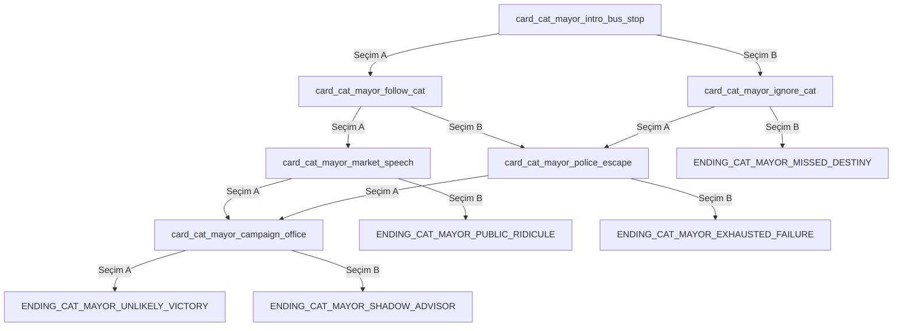

# Tekil Hikâye Üretim Spesifikasyonu İçin Kapsamlı Markdown Mimarisi

## Yönetici Özeti

Amaç, tek bir kısa hikâye fikrinden hareketle doğrudan uygulanabilir bir “hikâye paketi” üreten, belirsizlikleri kapatan ve hem web arayüzlerinde hem de depo içi araçlarda aynı sözleşmeyle çalışabilen bir üretim standardı oluşturmaktır. Bu standart; Markdown’u insan tarafından okunabilir üst seviye kural ve rapor katmanı, YAML’ı ise makinece parse edilebilir veri katmanı olarak kullanmalıdır. Markdown’un düz metin tabanlı ve yapısal belge yazımına uygun olması, CommonMark tarafından resmen tanımlanan başlık ve fenced code block kurallarıyla desteklenir; YAML ise okunabilir blok diziler ve anahtar/değer eşlemeleriyle düzenli veri paketleri için uygundur. Mermaid de hikâye akışını görselleştirmek için resmi akış diyagramı sözdizimi sağlar. citeturn2view0turn5view1turn5view4turn2view1turn3view3turn2view2

Bugüne kadarki taslakta en kritik iki belirsizlik şunlardır: tek stat olması gerekirken hâlâ beş stat tanımlanmış olması ve kart görseli ile arka plan katmanının ayrılmamış olması. Yüklenen önceki taslakta `health`, `money`, `reputation`, `intelligence` ve `luck` birlikte yer alıyor; bu, yeni sistemi doğrudan tek-stat mimarisine çevirmeden kullanılamayacağı anlamına gelir. Ayrıca aynı taslakta kart başına `imageId` tanımlanmasına rağmen `backgroundId` için ayrı bir üretim ve doğrulama katmanı yoktur. Bu rapor, o eksikleri kapatan yeni ana sözleşmeyi önerir. fileciteturn0file0

Önerilen hedef yapı şudur: elde yalnızca kısa bir fikir bulunduğunda, sistem tek seferde `story_input.yaml` benzeri bir girdiyi almalı; `story_data.yaml`, `story_visual_profile.yaml`, `character_visual_bible.yaml`, `asset_manifest.yaml`, `asset_prompts.yaml`, `story_flow.md` ve `validation_report.md` dosyalarını üretmelidir. Her kartta tam iki seçim bulunmalı, her seçim `resultText` ve yalnızca `healthDelta` içermeli, her seçim tam olarak `nextCardId` veya `endingId` ile sonlanmalı, bütün ID’ler içerikle anlamlı biçimde adlandırılmalı ve tüm çıktı kendi kendini doğrulayan bir raporla gelmelidir. citeturn2view1turn4view3turn2view2turn3view4turn3view9

## Varsayımlar ve Kesinleştirilmesi Gereken Tasarım Kararları

Bu rapor şu varsayımları temel alır. Birincisi, oyunda **tek stat yalnızca `health`** olacaktır. Başlangıç değeri, alt ve üst sınırları, sıfıra düştüğünde ne olacağı ve kart geçişinden önce mi sonra mı uygulanacağı yazılı sözleşmede sabitlenmelidir. Bu, önceki çok-stat taslağının yerine geçecek bilinçli bir tasarım kararıdır. fileciteturn0file0

İkincisi, **sıra anlamlı olan bütün koleksiyonlar YAML dizileri olarak tutulmalıdır**. YAML spesifikasyonu eşleme anahtarlarının sırasız olduğunu ve sıra önemliyse bunun bir dizi ile temsil edilmesi gerektiğini açıkça söyler. Bu nedenle `cards`, `endings`, `assets` ve `characters` alanlarının map değil sequence olması gerekir; benzersiz kimlikler de lookup için ayrıca kullanılmalıdır. Böylece hem yazar tarafından belirlenen akış sırası korunur hem de parse sırasında anahtar çakışma riskleri azaltılır. YAML ayrıca mapping anahtarlarının benzersiz olması gerektiğini ve anahtar çakışmalarının loading failure doğurabileceğini belirtir. citeturn4view3turn4view2turn4view4

Üçüncüsü, **Markdown dosyalarının tümü kopyala-yapıştır yapılabilir ve ayrıştırıcı dostu olmalıdır**. CommonMark, `#` ile ATX başlıklara ve üç veya daha fazla backtick/tilde ile fenced code block’lara izin verir; açılış fence satırındaki info string de blok türünü belirtmek için kullanılabilir. Bu yüzden web modunda dosyaları tek tek fenced block olarak dökmek teknik olarak doğru ve araç uyumlu bir seçimdir. citeturn5view4turn5view1turn5view2

Dördüncüsü, **hikâye akışı düğüm-adlı ve açık bağlantılı olmalıdır**. İnteraktif anlatı araçlarında da içeriğin düğümlere bölünmesi ve açık “divert” mantığıyla akması önerilir; ink dokümantasyonu “knots” ile adlandırılmış parçalara bölünmüş içerik ve `->` ile açık geçiş yaklaşımını tarif eder. Kart tabanlı sistemde bunun karşılığı `cardId`, `nextCardId` ve `endingId` sözleşmesidir. Aynı mantık, dal verme ve sonra sınırlı sayıda birleşme tasarlamayı da pratik kılar. citeturn3view9turn3view8

Beşincisi, **Mermaid akış şeması resmi akış görselleştirme dili olarak kullanılmalıdır**. Mermaid, `flowchart TD/TB/LR` yönlerini açıkça tanımlar; ayrıca düğüm etiketi olarak tamamen küçük harf `end` kullanımının sorun çıkarabileceğini de belgelendirir. Bu yüzden örnek şemalarda `E1`, `ENDING_A` veya `EndGood` gibi düğüm adları kullanılmalıdır. citeturn3view4turn3view5

## Önerilen Dosya Yapısı

Aşağıdaki dosyalar, belirsizliği gerçekten kapatan en küçük ama yeterli seti oluşturur. Burada yalnızca bir ana üretim standardı vardır; geri kalan dosyalar ya bu standardın üst bağlamını sağlar ya da tek hikâye üretiminin çıktısıdır.

| Dosya | Tür | Amaç | Zorunluluk |
|---|---|---|---|
| `/docs/GDD.md` | MD | Oyunun üst seviye kapsamı, ekran akışı, deneyim hedefi | Zorunlu |
| `/docs/GAME_RULES.md` | MD | “Tam 2 seçim”, “tek stat health”, “ekstra gameplay yok” gibi değişmez kurallar | Zorunlu |
| `/docs/STORY_GENERATOR_SPEC.md` | MD | Tek kısa fikirden implementation-ready hikâye paketi üretme sözleşmesi | Zorunlu |
| `/docs/AGENTS.md` | MD | Codex veya benzeri ajanların dosya önceliği ve davranış kuralları | Güçlü öneri |
| `/generated/<story_id>/STORY_OVERVIEW.md` | MD | İnsan okunur hikâye özeti, varsayımlar, ton, dallanma açıklaması | Çıktı |
| `/generated/<story_id>/story_input.yaml` | YAML | Girilen kısa fikir ve üretim ayarlarının normalize edilmiş kopyası | Çıktı |
| `/generated/<story_id>/story_visual_profile.yaml` | YAML | Hikâyenin zaman, tür, palet, yasak öğe, ışık, ortam profili | Çıktı |
| `/generated/<story_id>/character_visual_bible.yaml` | YAML | Karakter devamlılığı, yaş/versiyon, kıyafet, siluet, ayırt edici özellikler | Çıktı |
| `/generated/<story_id>/story_data.yaml` | YAML | Kartlar, seçimler, `healthDelta`, geçişler, ending’ler | Çıktı |
| `/generated/<story_id>/asset_manifest.yaml` | YAML | Tüm asset’lerin ID, tür, targetPath, ilişkili kart/ending, boyut, format bilgisi | Çıktı |
| `/generated/<story_id>/asset_prompts.yaml` | YAML | Her asset için image prompt şablonlarının somutlaştırılmış halleri | Çıktı |
| `/generated/<story_id>/story_flow.md` | MD | Dallanma, birleşme, erişilebilir ending’ler ve Mermaid akış diyagramı | Çıktı |
| `/generated/<story_id>/validation_report.md` | MD | Yapısal, anlamsal ve akış doğrulama sonuçları | Çıktı |

Bu yapıda **tek ana kural dosyası** `STORY_GENERATOR_SPEC.md` olur. `GDD.md` ve `GAME_RULES.md` bunun üstünde yer alır; yani üretim standardı onları değiştirmez, onları uygular. Bu ayrım, Markdown’un okunabilir metin gücü ile YAML’ın veri taşıma gücünü bilinçli biçimde ayırır. CommonMark ve YAML dokümanları bu kullanım biçimiyle uyumludur. citeturn2view0turn2view1turn3view3

## Ana Dosya Olarak STORY_GENERATOR_SPEC.md Nasıl Tasarlanmalı

Bu dosya tek seferde hem üretim promptu hem veri sözleşmesi hem de doğrulama standardı olmalıdır. En sağlam yapı, dosyanın başına kısa bir “öncelik sırası” kuralı koymaktır: `GAME_RULES.md` birinci önceliktir, `GDD.md` ikinci önceliktir, `STORY_GENERATOR_SPEC.md` ise üçüncü önceliktir. Böylece üretici model, oyun kuralını bozacak şekilde yeni bir alan uyduramaz.

Ana dosyanın içeriği şu mantıksal bölümlerden oluşmalıdır: amaç, girdi sözleşmesi, üretim ayarları, sağlık kuralları, kart kuralları, dallanma kuralları, görsel ve asset kuralları, karakter devamlılığı, çıktı paket yapısı, çıktı modları ve doğrulama. Bu yapı, hem insan okur için anlaşılır kalır hem de fenced code block’lar içindeki YAML şablonlarıyla doğrudan uygulanabilir olur. CommonMark fenced code block’lar için info string desteği verdiğinden `yaml`, `md` ve `mermaid` blokları tek dosya içinde güvenle tutulabilir. citeturn5view1turn5view2

Aşağıdaki iskelet, ana dosyanın omurgası olarak kullanılabilir:

```md
# STORY_GENERATOR_SPEC.md

## Amaç
Kısa bir hikâye fikrinden implementation-ready hikâye paketi üret.

## Öncelik Sırası
1. GAME_RULES.md
2. GDD.md
3. STORY_GENERATOR_SPEC.md

## Dil ve Yazım Kuralları
- Kullanıcıya gösterilen tüm metinler Türkçe.
- ID alanları ASCII snake_case.
- Türkçe karakterler ID içine girmez; içerik metninde serbesttir.

## Girdi Sözleşmesi
- story concept
- optional setting
- optional tone keywords
- optional generation settings

## Üretim Ayarları
- storyLengthTier
- absurdityLevel
- darknessLevel
- comedyLevel
- branchingLevel
- outputMode

## Sağlık Kuralları
- Tek stat: health
- initialHealth
- minHealth
- maxHealth
- clamp behavior
- zero-health handling

## Kart Kuralları
- Her kartta tam 2 seçim
- Her seçimde resultText
- Her seçimde healthDelta
- Her seçimde nextCardId veya endingId
- Seçim metni kısa, tamamlanmış, noktalı ve doğrudan eylem cümlesi olmalı
- Sonuç metni seçim açıklamasını tekrar etmeden doğrudan gerçekleşen olayı anlatmalı
- `Şu yolu seçersin`, `Bu yolu seçersin`, `Bu seçimi yaparsan`, `Seçimin sonucunda`, `Bu hamle` gibi meta kalıplar yasak
- Sonuç metni tercihen tek cümle, en fazla iki kısa cümle olmalı

## Dallanma Kuralları
- En az 2 büyük branch
- Kontrollü merge serbest
- Sonsuz loop yasak
- Dead end yasak

## Görsel Kuralları
- backgroundId ayrı
- imageId ayrı
- coverImageId zorunlu
- ending image zorunlu
- asset targetPath zorunlu

## Karakter Devamlılığı
- canonical appearance
- age variants
- costume variants
- forbidden drift rules

## Çıktı Paket Yapısı
- story_input.yaml
- story_visual_profile.yaml
- character_visual_bible.yaml
- story_data.yaml
- asset_manifest.yaml
- asset_prompts.yaml
- story_flow.md
- validation_report.md

## Çıktı Modları
- web
- repo

## Doğrulama
- schema checks
- graph checks
- health checks
- asset checks
- prompt checks
```

Bu bölümlerin tamamı aynı dosyada yer alınca, web üstünde çalışan bir modelden de depo içindeki Codex oturumundan da aynı deterministik yapıda çıktı almak mümkün olur. Markdown başlıkları ve fenced block’lar uzun spesifikasyonları okunur tutarken, YAML blokları gerçek veri sözleşmesini taşıyacaktır. citeturn2view0turn5view4turn5view1

## Şema, Şablon ve Paket Formatı

### Girdi şeması

Üretim sistemi, kullanıcıdan minimum girdi ile çalışmalı ama mümkün olduğunda ayarları normalize ederek `story_input.yaml` dosyasına yazmalıdır. Aşağıdaki şema, kısa fikirden seri üretime geçmek için yeterlidir:

```yaml
storyInput:
  storyIdHint: "istanbul_kedi_belediye"
  titleHint: "Konuşan Kedinin Seçimi"
  concept: "İşsiz bir adam, konuşan bir sokak kedisinin belediye başkanı olmasına yardım etmeye çalışır."
  settingHint: "günümüz İstanbul"
  toneKeywords:
    - "absürt"
    - "komik"
    - "hafif karanlık"
  generationSettings:
    storyLengthTier: "medium"
    absurdityLevel: 4
    darknessLevel: 2
    comedyLevel: 4
    branchingLevel: 3
    outputMode: "auto"
```

Buradaki `storyLengthTier`, `absurdityLevel`, `darknessLevel`, `comedyLevel` ve `branchingLevel` alanları belirsizliği kapatır. Özellikle absürtlük ve komedi seviyeleri, “saçma ama anlamsız olmasın” türü yorum farklarını azaltır. Bu, teknik bir oyun standardıdır; dış kaynaktaki bir norm değil, önerilen üretim sözleşmesidir.

### Hikâye uzunluk katmanları

Aşağıdaki katmanlar, kullanıcının “kısa/orta/uzun” beklentisini doğrudan kart ve ending sayısına çevirir.

| Tier | Kart Sayısı | Ending Sayısı | Ortalama Tek Oynanışta Görülen Kart | Amaç |
|---|---:|---:|---:|---|
| `compact` | 20–24 | 3–4 | 8–12 | Hızlı prototip ve tema denemesi |
| `medium` | 28–36 | 5–7 | 11–17 | Dengeli ticari içerik üretimi |
| `long` | 40–48 | 8–10 | 15–24 | Geniş dallanmalı, tekrar oynanabilir hikâye |

Bu tier sistemi, kullanıcının istediği 20–48 kart ve 3–10 ending aralığını doğrudan formalize eder ve üreticiye net hedef verir.

### Sağlık ve sıfır-can sözleşmesi

Tek stat `health` olduğundan sağlık davranışı mutlak olarak tanımlanmalıdır. Önerilen sözleşme şöyledir:

```yaml
healthRules:
  initialHealth: 5
  minHealth: 0
  maxHealth: 10
  preferredDeltaRange:
    min: -2
    max: 2
  overflowPolicy: "clamp"
  underflowPolicy: "clamp"
  zeroHealthPolicy: "fail_to_zero_health_ending"
```

Hikâye metadata’sında ayrıca bir varsayılan sıfır-can ending’i bulunmalıdır:

```yaml
story:
  storyId: "story_absurd_cat_mayor"
  title: "Konuşan Kedinin Seçimi"
  description: "..."
  startCardId: "card_cat_mayor_intro_bus_stop"
  coverImageId: "cover_cat_mayor_istanbul_evening"
  visualProfileId: "vp_cat_mayor_modern_absurd"
  defaultZeroHealthEndingId: "ending_cat_mayor_exhausted_failure"
  initialStats:
    health: 5
```

Seçim çözümlenmesi için önerilen tek kural şudur: önce `resultText` gösterilir, sonra `healthDelta` uygulanır, `health` 0–10 aralığına clamp edilir, değer 0 ise önce `zeroHealthEndingId` varsa ona gidilir, yoksa `defaultZeroHealthEndingId` kullanılır; sağlık 0 değilse seçimdeki `endingId` veya `nextCardId` işletilir. Bu karar, tek-stat tasarımını uygulamada belirsiz bırakmamak için şarttır.

### Hikâye verisi şeması

Kart, seçim ve ending yapısının tam şeması aşağıdaki gibi olmalıdır. Diziler özellikle sequence olarak tanımlanmıştır; çünkü YAML, map anahtar sırasını anlamsal olarak garanti etmez ve sıra önemliyse sequence kullanılmasını önerir. citeturn4view3turn3view3

```yaml
story:
  storyId: ""
  title: ""
  description: ""
  startCardId: ""
  coverImageId: ""
  visualProfileId: ""
  defaultZeroHealthEndingId: ""
  initialStats:
    health: 5

cards:
  - cardId: ""
    storyId: ""
    title: ""
    text: ""
    backgroundId: ""
    imageId: ""
    tags: []
    choices:
      - choiceId: ""
        text: ""
        resultText: ""
        healthDelta: 0
        nextCardId: ""

      - choiceId: ""
        text: ""
        resultText: ""
        healthDelta: 0
        endingId: ""

endings:
  - endingId: ""
    storyId: ""
    title: ""
    text: ""
    endingType: ""
    backgroundId: ""
    imageId: ""
```

Bu noktada birkaç kural katı olmalıdır. Her kartta **tam iki seçim** olmalıdır. Her seçimde **yalnızca bir** sonuç hedefi bulunmalıdır; yani ya `nextCardId` ya `endingId`. Aynı seçimde ikisi birden yasaktır. Her seçimde `healthDelta` açık biçimde yazılmalıdır; “değişmiyorsa yazma” yaklaşımı yasak olmalıdır. Seçim metni yalnızca oyuncunun kısa eylemini, `resultText` ise bu eylemden sonra gerçekleşen kısa ve somut olayı anlatmalıdır; sonuç metni seçim metnini veya stat/branch açıklamasını tekrar etmemelidir. Bu, parser ve validator’ların eksiksiz çalışmasını sağlar.

### Görsel profil şeması

Hikâyenin dönem, palet ve yasak öğelerini üretmeden fanatik şekilde ilerlemek, özellikle “orta çağ olmak zorunda değil” ihtiyacını karşılamak için şarttır. Bu nedenle görsel profil dosyası ayrı tutulmalıdır.

```yaml
visualProfile:
  visualProfileId: ""
  storyId: ""
  timePeriod: ""
  genre: ""
  mood:
    - ""
  colorPalette:
    - ""
  lighting: ""
  weatherBias: ""
  characterStyle: ""
  environmentStyle: ""
  allowedElements: []
  forbiddenElements: []
  globalStyleRules:
    - "2D illustrated storybook style"
    - "hand-drawn or painterly feeling"
    - "clear silhouettes"
    - "readable at card size"
    - "no photorealism"
    - "no 3D render look"
    - "no text in image"
    - "no logo"
    - "no watermark"
```

### Karakter görsel incili

Karakter devamlılığı, seri hikâye üretiminde en çok bozulan alandır. Bu yüzden ayrı bir “visual bible” dosyası gereklidir. Her kart promptu, bu dosyadaki kanonik görsel imzayı referans almalıdır.

```yaml
characters:
  - characterId: "char_cat_mayor_protagonist"
    storyId: "story_absurd_cat_mayor"
    role: "protagonist"
    displayName: "Cem"
    species: "human"
    canonicalAppearance:
      ageLook: "30s"
      bodyType: "lean"
      faceShape: "long"
      skinTone: "light olive"
      hair: "short dark wavy hair"
      eyes: "brown"
      distinguishingFeatures:
        - "small scar above left eyebrow"
        - "slightly tired eyes"
    clothingBase:
      - "worn dark jacket"
      - "faded hoodie"
      - "cheap sneakers"
    ageVariants: []
    poseAndExpressionBias:
      - "confused but determined"
      - "slightly sleep-deprived"
    forbiddenDrift:
      - "do not change hair color"
      - "do not remove eyebrow scar"
      - "do not switch body type dramatically"

  - characterId: "char_cat_mayor_talking_cat"
    storyId: "story_absurd_cat_mayor"
    role: "deuteragonist"
    displayName: "Şehsuvar"
    species: "cat"
    canonicalAppearance:
      fur: "scruffy gray tabby"
      eyes: "amber"
      distinguishingFeatures:
        - "notched left ear"
        - "white patch on chest"
    clothingBase: []
    poseAndExpressionBias:
      - "judgmental stare"
      - "regal posture"
    forbiddenDrift:
      - "do not turn into fluffy longhair"
      - "do not change eye color"
```

### Asset kimliklendirme ve hedef yollar

Kimlikler içerikle anlamlı olmalı ve dosyanın ne olduğunu ID’den anlamak mümkün olmalıdır. Çünkü kullanıcı bunu özellikle talep ediyor. Önerilen kurallar şunlardır: tüm ID’ler `lowercase snake_case`, ASCII, boşluksuz, uzantısız ve içerik tabanlı olur. Önekler tip zorlamasını sağlar.

| Asset Türü | Önek | Örnek ID | Önerilen Target Path |
|---|---|---|---|
| Story cover | `cover_` | `cover_cat_mayor_istanbul_evening` | `Assets/Resources/Art/Stories/<storyId>/Covers/<assetId>.png` |
| Background | `bg_` | `bg_cat_mayor_bus_stop_rainy_evening` | `Assets/Resources/Art/Stories/<storyId>/Backgrounds/<assetId>.png` |
| Card image | `img_` | `img_cat_mayor_cat_on_ticket_machine` | `Assets/Resources/Art/Stories/<storyId>/CardImages/<assetId>.png` |
| Ending image | `end_img_` | `end_img_cat_mayor_feathered_campaign` | `Assets/Resources/Art/Stories/<storyId>/Endings/<assetId>.png` |
| Shared character sheet | `char_ref_` | `char_ref_cat_mayor_protagonist` | `Assets/Resources/Art/Stories/<storyId>/CharacterRefs/<assetId>.png` |

Bu düzen, repo modunda asset’lerin fiziksel yerlerini sabitler; web modunda ise üretilecek dosyaların nereye yazılacağını açıkça tarif eder. YAML tarafında her asset manifest girdisi tek ve benzersiz anahtarlı olmalı; anahtarların benzersizliği YAML’ın temel gereğidir. citeturn4view2turn4view4

### Asset manifest şeması

```yaml
assets:
  - assetId: ""
    storyId: ""
    assetType: "story_cover"
    relatedTo:
      storyId: ""
    targetPath: "Assets/Resources/Art/Stories/<storyId>/Covers/<assetId>.png"
    format: "png"
    size: "1536x1024"
    background: "opaque"

  - assetId: ""
    storyId: ""
    assetType: "background"
    relatedTo:
      cardIds: [""]
    targetPath: "Assets/Resources/Art/Stories/<storyId>/Backgrounds/<assetId>.png"
    format: "png"
    size: "1536x1024"
    background: "opaque"

  - assetId: ""
    storyId: ""
    assetType: "card_image"
    relatedTo:
      cardIds: [""]
    targetPath: "Assets/Resources/Art/Stories/<storyId>/CardImages/<assetId>.png"
    format: "png"
    size: "1536x1024"
    background: "opaque"

  - assetId: ""
    storyId: ""
    assetType: "ending_image"
    relatedTo:
      endingIds: [""]
    targetPath: "Assets/Resources/Art/Stories/<storyId>/Endings/<assetId>.png"
    format: "png"
    size: "1536x1024"
    background: "opaque"
```

### Görsel prompt şablonları

Kart görseli ve arka plan promptlarının ayrılması kritik bir netleştirmedir. `backgroundId`, mekân atmosferini; `imageId` ise kartın olay odağını anlatır.

```yaml
assets:
  - assetId: "bg_cat_mayor_bus_stop_rainy_evening"
    storyId: "story_absurd_cat_mayor"
    assetType: "background"
    prompt: >
      Create a 2D illustrated storybook-style background for a narrative card game.
      Story theme: modern Istanbul, absurd comedy, slight melancholy.
      Scene: rainy evening bus stop in a crowded district, wet pavement, distant apartment lights,
      space left for card UI overlay.
      Mood: awkward, damp, urban, faintly magical.
      Style: hand-drawn, painterly, readable at card size, clear silhouettes.
      Do not include text, logos, watermark, photorealism, 3D render look, or wrong-era props.

  - assetId: "img_cat_mayor_cat_on_ticket_machine"
    storyId: "story_absurd_cat_mayor"
    assetType: "card_image"
    prompt: >
      Create a 2D illustrated storybook-style card scene for a narrative card game.
      Story theme: modern Istanbul, absurd comedy.
      Character continuity: scruffy gray tabby with amber eyes, white chest patch, notched left ear;
      lean man in worn dark jacket, eyebrow scar.
      Scene: the talking cat stands on a ticket machine like a tiny statesman while the man stares in disbelief.
      Mood: absurd, witty, slightly desperate.
      Composition: clear focal subject, readable at small size, uncluttered.
      Style: hand-drawn, painterly, expressive faces, no text, no logo, no watermark, no photorealism.
```

### Dallanma ve birleşme kuralları

Yapının sadece genişleyen bir ağaç olmaması gerekir; kontrollü birleşme serbest bırakılmalıdır. İnteraktif anlatı dillerinde içeriğin adlandırılmış bölümlere ayrılması ve açık geçişlerle örgütlenmesi standart bir pratiktir; ink’teki knot ve divert yaklaşımı bunun iyi bir örneğidir. Kart sisteminde bunun eşleniği, kartların kimlikli düğümler olarak modellenmesi ve seçimlerin açık hedeflere bağlanmasıdır. citeturn3view9turn3view8

Önerilen kurallar şunlardır: başlangıç kartı tektir; en az iki büyük dal bulunur; dallar daha sonra bir veya iki kriz düğümünde birleşebilir; sonsuz döngü yasaktır; endingsiz dead-end yasaktır; her ending başlangıçtan erişilebilir olmalıdır; aynı ending’e giden en az iki yol olabilir ama anlatı anlamı değişmelidir. Bu kurallar, “çok dallansın ama patlamasın” ihtiyacını pratik bir üretim biçimine dönüştürür.

### Mermaid akış diyagramı örneği

Aşağıdaki örnek, `story_flow.md` içinde kullanılabilecek minimal fakat doğru bir Mermaid şemasıdır. `flowchart TD` resmi yönlerden biridir; `end` yerine `ENDING_*` benzeri düğüm adları kullanılmıştır çünkü Mermaid küçük harf `end` için uyarı verir. citeturn3view4turn3view5



## Doğrulama, Çıktı Modları ve Uygulamaya Hazırlık

### Çıktı modları

Web ve repo modları açık biçimde ayrılmalıdır; aksi halde model “dosya yaz” ile “yanıtta bloklar halinde dök” arasında kararsız kalır.

| Mod | Davranış | Biçim | Özel Kural |
|---|---|---|---|
| `repo` | Dosyaları doğrudan hedef yollara yazar | Gerçek dosya üretimi | Var olan dosyalar üzerine yazmadan önce listele |
| `web` | Her dosyayı sırayla fenced code block içinde döker | `md`, `yaml`, `mermaid` info string’li bloklar | Her bloktan önce tam dosya yolunu yaz |
| `auto` | Ortamı tahmin eder; dosya sistemi varsa repo, yoksa web | Ortama göre | Belirsizlikte `web`e düş |

Bu yaklaşım, CommonMark fenced code block mantığıyla uyumludur; açılış çiti sonrası info string başlıklarıyla blok türleri ayrıştırıcı dostu hale gelir. citeturn5view1turn5view2

### Validation checklist tablosu

Aşağıdaki kontrol listesi, `validation_report.md` içinde mutlaka tablo halinde verilmelidir. Çünkü kullanıcı “kafasında hiçbir soru işareti kalmasın” diyor; bunun pratik karşılığı yalnızca üretmek değil, üretileni denetlemektir.

| Kontrol | Açıklama | Şiddet | Otomatik |
|---|---|---|---|
| Story metadata present | `storyId`, `title`, `description`, `startCardId` var mı | Bloklayıcı | Evet |
| Single stat only | `health` dışında stat alanı üretilmiş mi | Bloklayıcı | Evet |
| Health rules present | `initialHealth`, `minHealth`, `maxHealth`, zero-health policy var mı | Bloklayıcı | Evet |
| Card count in tier range | Seçilen tier ile kart sayısı uyumlu mu | Bloklayıcı | Evet |
| Ending count in tier range | Seçilen tier ile ending sayısı uyumlu mu | Bloklayıcı | Evet |
| Exactly two choices | Her kartta tam iki seçim var mı | Bloklayıcı | Evet |
| Choice text present | Her seçimde `text` alanı var mı | Bloklayıcı | Evet |
| Result text present | Her seçimde `resultText` var mı | Bloklayıcı | Evet |
| Health delta present | Her seçimde `healthDelta` açıkça yazılmış mı | Bloklayıcı | Evet |
| Exclusive transition | Bir seçimde yalnızca `nextCardId` veya `endingId` var mı | Bloklayıcı | Evet |
| `nextCardId` validity | Tüm `nextCardId` değerleri gerçek karta gidiyor mu | Bloklayıcı | Evet |
| `endingId` validity | Tüm `endingId` değerleri gerçek ending’e gidiyor mu | Bloklayıcı | Evet |
| Start reachable graph | Tüm kartlar `startCardId`’den erişilebilir mi | Bloklayıcı | Evet |
| Ending reachability | Her ending gerçekten erişilebilir mi | Bloklayıcı | Evet |
| No dead ends | Endingsiz çıkmaz düğüm var mı | Bloklayıcı | Evet |
| No infinite loops | Sürekli dönen yol var mı | Bloklayıcı | Evet |
| Background present | Her kartta `backgroundId` var mı | Bloklayıcı | Evet |
| Card image present | Her kartta `imageId` var mı | Bloklayıcı | Evet |
| Ending visuals present | Her ending’de görsel alanları mevcut mu | Yüksek | Evet |
| Asset manifest completeness | Tüm `backgroundId` ve `imageId` değerleri manifestte var mı | Bloklayıcı | Evet |
| Target path present | Her asset girdisinde `targetPath` var mı | Bloklayıcı | Evet |
| ID naming convention | Tüm ID’ler snake_case ve anlamlı mı | Yüksek | Kısmen |
| No duplicate YAML keys | Aynı mapping anahtarı tekrarı var mı | Bloklayıcı | Evet |
| Character continuity coverage | Ana karakterler visual bible’da tanımlı mı | Yüksek | Evet |
| Prompt continuity coverage | İlgili promptlar character continuity referanslarını kullanıyor mu | Yüksek | Kısmen |
| Absurdity settings applied | Üretilen kartlar absürtlük/darkness/comedy ayarıyla tutarlı mı | Orta | Kısmen |
| Zero-health outcome covered | Sağlık 0 olduğunda tanımlı bir sonuç var mı | Bloklayıcı | Evet |
| At least one healing path | En az bir sağlık artıran seçim yolu var mı | Orta | Evet |
| At least one damaging path | En az bir sağlık azaltan seçim yolu var mı | Orta | Evet |

YAML tarafında benzersiz anahtar gerekliliği önemlidir; spesifikasyon, mapping anahtarlarının benzersiz olması gerektiğini ve unique olmayan anahtarların loading failure sayılabileceğini belirtir. Bu yüzden validation raporunda duplicate key kontrolü açık bir satır olmalıdır. citeturn4view2turn4view4

### Validation raporu şablonu

```md
# Validation Report

## Özet
- storyId: story_absurd_cat_mayor
- tier: medium
- totalCards: 32
- totalChoices: 64
- totalEndings: 6
- totalAssets: 71

## Sonuç
Durum: PASS

## Kontroller
| Kontrol | Sonuç | Not |
|---|---|---|
| Exactly two choices per card | PASS | Tüm 32 kart doğrulandı |
| Single stat only | PASS | Yalnızca health bulundu |
| Background coverage | PASS | 32/32 kartta backgroundId mevcut |
| Card image coverage | PASS | 32/32 kartta imageId mevcut |
| Reachability | PASS | Tüm kartlar ve 6 ending erişilebilir |
| Dead-end check | PASS | Endingsiz dead-end yok |
| Infinite loop check | PASS | Döngü saptanmadı |
| Zero-health handling | PASS | story default ending mevcut |
| Duplicate YAML keys | PASS | Çakışma bulunmadı |

## Problemler
Yok.

## Uygulama Hazırlığı
Bu paket implementation-ready kabul edilmiştir.
```

## Codex İçin Minimal AGENTS Tarzı Talimat

Aşağıdaki kısa talimat dosyası, tüm sistemi Codex tarafında güvenli ve dar kapsamda tutmak için yeterlidir. Bu bölüm tasarım önerisidir; dış bir standart değil, bu raporun önerdiği çalışma sözleşmesidir.

```md
# AGENTS.md

## Öncelik Sırası
Her değişiklikten önce şu dosyaları bu sırayla oku:
1. /docs/GAME_RULES.md
2. /docs/GDD.md
3. /docs/STORY_GENERATOR_SPEC.md

## Ana Görev
Kullanıcı kısa bir hikâye fikri verdiğinde implementation-ready hikâye paketi üret.

## Değişmez Kurallar
- Oyunda tek stat yalnızca `health`tir.
- Her kartta tam olarak 2 seçim vardır.
- Her seçimde `resultText` bulunur.
- Her seçimde `healthDelta` açıkça yazılır.
- Her seçim tam olarak `nextCardId` veya `endingId` içerir.
- Her kartta `backgroundId` ve `imageId` bulunur.
- Her asset için `assetId`, `targetPath` ve `prompt` üretilir.
- Tüm ID’ler ASCII snake_case ve içerikle anlamlı olmalıdır.
- Tüm kullanıcıya gösterilen metinler Türkçe olmalıdır.
- `story_data.yaml`, `asset_manifest.yaml`, `asset_prompts.yaml`, `story_flow.md`, `validation_report.md` eksiksiz üretilmelidir.

## Yasaklar
- Yeni stat ekleme.
- 2’den fazla seçim ekleme.
- Inventory, combat, crafting, map movement, shop, XP, skill tree ekleme.
- Eksik geçiş bırakma.
- Belirsiz sıfır-can davranışı bırakma.
- Generic ID kullanma (`image1`, `card2`, `ending_final` gibi).

## Çıktı Modu
- Repo ortamında dosyaları hedef yollara yaz.
- Web ortamında her dosyayı ayrı fenced code block içinde üret.
- Eğer ortam belirsizse web modunu kullan.

## Done Kriteri
Aşağıdakiler olmadan görev tamamlanmış sayılmaz:
- Validation report PASS
- Tüm kartlar erişilebilir
- Tüm endingler erişilebilir
- Hiçbir seçim eksik değil
- Hiçbir asset refsiz değil
- Zero-health handling tanımlı
```

## Sonuç ve Nihai Öneri

Tek bir ana dosya ile gerçekten seri hikâye üretimine geçmek istiyorsan en doğru çekirdek yapı şudur: `GDD.md` kapsamı tanımlar, `GAME_RULES.md` oyunun değişmez sınırlarını kilitler, `STORY_GENERATOR_SPEC.md` ise kısa fikirden implementation-ready paket üretme davranışını belirler. Bu üçlüye ince bir `AGENTS.md` eklendiğinde Codex tarafında pratikte belirsizlik kalmaz. Markdown’un düz metin yapısı ve fenced code block desteği, YAML’ın sequence/mapping modeli ve unique key ilkesi, Mermaid’in akış diyagramı sözdizimi ve ink’in açık düğüm/geçiş mantığı bu mimariyi teknik olarak destekler. citeturn2view0turn5view1turn2view1turn4view3turn4view2turn2view2turn3view4turn3view9turn3view8

Bu raporun en kritik kararları şunlardır: önceki taslaktaki çok-stat yapıyı kaldırıp yalnızca `health` bırakmak; `backgroundId` ile `imageId`’yi zorunlu ve ayrı katmanlar haline getirmek; sıfır-can davranışını kesinleştirmek; sequence tabanlı YAML düzenine geçmek; ID adlandırmayı içerik temelli snake_case standardına bağlamak; karakter sürekliliğini `character_visual_bible.yaml` ile sabitlemek; validation raporunu üretimin zorunlu son adımı haline getirmek ve web/repo modlarını açıkça ayırmaktır. Önceki dosyada beş stat ve daha dar bir çıktı yapısı olduğu için, yeni ana spesifikasyonun onu açıkça geçersiz kıldığını belirtmek de gerekir. fileciteturn0file0

## Varsayımlar

Bu raporda açıkça belirtilmeyen noktalarda şu varsayımlar kullanılmıştır. Kullanıcıya gösterilen anlatı metinleri Türkçe olacak, fakat teknik ID’ler ASCII `snake_case` olacaktır. Varsayılan başlangıç canı `5`, min `0`, max `10` kabul edilmiştir. Varsayılan görsel formatı `png`, varsayılan target path kökü `Assets/Resources/Art/Stories/<storyId>/...` kabul edilmiştir. `outputMode: auto` belirsizlikte `web` moduna düşer. `compact`, `medium` ve `long` tier’ları sırasıyla 20–24, 28–36 ve 40–48 kart olarak önerilmiştir. Bunlar dış kaynaktaki zorunlu standartlar değil, bu raporun önerdiği uygulanabilir varsayımlardır.
