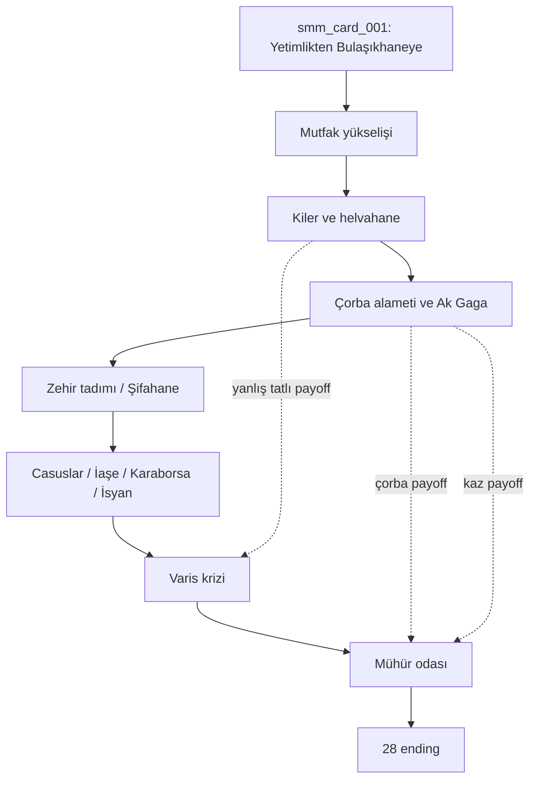

# STORY FLOW

## Başlangıç Kartı

Başlangıç kartı `smm_card_001` oyuncuyu aç bir yetim olarak saray bulaşıkhanesine sokar. İlk seçimler hayatta kalma, dürüstlük, küçük hırsızlık ve saray içi gözlem eksenlerini kurar.

## Chapter Akışı

| Part | Chapter | İlk Kart | Son Kart | Stage | Route |
|---|---|---|---|---|---|
| CARDS_PART_01_INTRO.yaml | intro | smm_card_001 | smm_card_025 | intro | intro |
| CARDS_PART_02_KITCHEN_RISE.yaml | kitchen_rise | smm_card_026 | smm_card_050 | growth | kitchen_rise |
| CARDS_PART_03_PANTRY_AND_PASTRY.yaml | pantry_and_pastry | smm_card_051 | smm_card_075 | growth | pantry_pastry |
| CARDS_PART_04_SOUP_OMEN_AND_GOOSE.yaml | soup_omen_and_goose | smm_card_076 | smm_card_100 | growth | soup_goose |
| CARDS_PART_05_POISON_TASTER.yaml | poison_taster | smm_card_101 | smm_card_125 | growth | poison_taster |
| CARDS_PART_06_HEALER_PATH.yaml | healer_path | smm_card_126 | smm_card_150 | growth | healer_path |
| CARDS_PART_07_SPY_NETWORK.yaml | spy_network | smm_card_151 | smm_card_175 | crisis | spy_network |
| CARDS_PART_08_ARMY_SUPPLY.yaml | army_supply | smm_card_176 | smm_card_200 | crisis | army_supply |
| CARDS_PART_09_BLACK_MARKET.yaml | black_market | smm_card_201 | smm_card_225 | crisis | black_market |
| CARDS_PART_10_REBELLION.yaml | rebellion | smm_card_226 | smm_card_250 | crisis | rebellion |
| CARDS_PART_11_HEIRS_AND_FACTIONS.yaml | heirs_and_factions | smm_card_251 | smm_card_275 | crisis | heirs_and_factions |
| CARDS_PART_12_SEAL_AND_FINALS.yaml | seal_and_finals | smm_card_276 | smm_card_300 | final | seal_and_finals |

## Merge Noktaları

- `smm_card_026`: erken yoksulluk seçimleri büyük mutfak düzenine bağlanır.
- `smm_card_076`: mutfak, helvahane ve kilerden gelen izler çorba/kaz absürtlüğüne bağlanır.
- `smm_card_151`: zehir ve şifa bilgisi casusluk ağıyla birleşir.
- `smm_card_226`: iaşe, karaborsa ve halk açlığı isyan hattına bağlanır.
- `smm_card_251`: tüm ana rotalar varis krizine girer.
- `smm_card_276`: varis krizi mühür odası final zincirine bağlanır.

## Büyük Branch Noktaları

| Branch | Kart | İşlev |
|---|---|---|
| 1 | smm_card_008 | Rota sayaçları ve kalıcı bayraklar iki seçime göre ayrılır, sonraki bottleneck kartlarında yankılanır. |
| 2 | smm_card_016 | Rota sayaçları ve kalıcı bayraklar iki seçime göre ayrılır, sonraki bottleneck kartlarında yankılanır. |
| 3 | smm_card_024 | Rota sayaçları ve kalıcı bayraklar iki seçime göre ayrılır, sonraki bottleneck kartlarında yankılanır. |
| 4 | smm_card_032 | Rota sayaçları ve kalıcı bayraklar iki seçime göre ayrılır, sonraki bottleneck kartlarında yankılanır. |
| 5 | smm_card_040 | Rota sayaçları ve kalıcı bayraklar iki seçime göre ayrılır, sonraki bottleneck kartlarında yankılanır. |
| 6 | smm_card_048 | Rota sayaçları ve kalıcı bayraklar iki seçime göre ayrılır, sonraki bottleneck kartlarında yankılanır. |
| 7 | smm_card_056 | Rota sayaçları ve kalıcı bayraklar iki seçime göre ayrılır, sonraki bottleneck kartlarında yankılanır. |
| 8 | smm_card_064 | Rota sayaçları ve kalıcı bayraklar iki seçime göre ayrılır, sonraki bottleneck kartlarında yankılanır. |
| 9 | smm_card_072 | Rota sayaçları ve kalıcı bayraklar iki seçime göre ayrılır, sonraki bottleneck kartlarında yankılanır. |
| 10 | smm_card_080 | Rota sayaçları ve kalıcı bayraklar iki seçime göre ayrılır, sonraki bottleneck kartlarında yankılanır. |
| 11 | smm_card_088 | Rota sayaçları ve kalıcı bayraklar iki seçime göre ayrılır, sonraki bottleneck kartlarında yankılanır. |
| 12 | smm_card_096 | Rota sayaçları ve kalıcı bayraklar iki seçime göre ayrılır, sonraki bottleneck kartlarında yankılanır. |
| 13 | smm_card_104 | Rota sayaçları ve kalıcı bayraklar iki seçime göre ayrılır, sonraki bottleneck kartlarında yankılanır. |
| 14 | smm_card_112 | Rota sayaçları ve kalıcı bayraklar iki seçime göre ayrılır, sonraki bottleneck kartlarında yankılanır. |
| 15 | smm_card_120 | Rota sayaçları ve kalıcı bayraklar iki seçime göre ayrılır, sonraki bottleneck kartlarında yankılanır. |
| 16 | smm_card_128 | Rota sayaçları ve kalıcı bayraklar iki seçime göre ayrılır, sonraki bottleneck kartlarında yankılanır. |
| 17 | smm_card_136 | Rota sayaçları ve kalıcı bayraklar iki seçime göre ayrılır, sonraki bottleneck kartlarında yankılanır. |
| 18 | smm_card_144 | Rota sayaçları ve kalıcı bayraklar iki seçime göre ayrılır, sonraki bottleneck kartlarında yankılanır. |
| 19 | smm_card_152 | Rota sayaçları ve kalıcı bayraklar iki seçime göre ayrılır, sonraki bottleneck kartlarında yankılanır. |
| 20 | smm_card_160 | Rota sayaçları ve kalıcı bayraklar iki seçime göre ayrılır, sonraki bottleneck kartlarında yankılanır. |
| 21 | smm_card_168 | Rota sayaçları ve kalıcı bayraklar iki seçime göre ayrılır, sonraki bottleneck kartlarında yankılanır. |
| 22 | smm_card_176 | Rota sayaçları ve kalıcı bayraklar iki seçime göre ayrılır, sonraki bottleneck kartlarında yankılanır. |
| 23 | smm_card_184 | Rota sayaçları ve kalıcı bayraklar iki seçime göre ayrılır, sonraki bottleneck kartlarında yankılanır. |
| 24 | smm_card_192 | Rota sayaçları ve kalıcı bayraklar iki seçime göre ayrılır, sonraki bottleneck kartlarında yankılanır. |
| 25 | smm_card_200 | Rota sayaçları ve kalıcı bayraklar iki seçime göre ayrılır, sonraki bottleneck kartlarında yankılanır. |
| 26 | smm_card_208 | Rota sayaçları ve kalıcı bayraklar iki seçime göre ayrılır, sonraki bottleneck kartlarında yankılanır. |
| 27 | smm_card_216 | Rota sayaçları ve kalıcı bayraklar iki seçime göre ayrılır, sonraki bottleneck kartlarında yankılanır. |
| 28 | smm_card_224 | Rota sayaçları ve kalıcı bayraklar iki seçime göre ayrılır, sonraki bottleneck kartlarında yankılanır. |
| 29 | smm_card_232 | Rota sayaçları ve kalıcı bayraklar iki seçime göre ayrılır, sonraki bottleneck kartlarında yankılanır. |
| 30 | smm_card_240 | Rota sayaçları ve kalıcı bayraklar iki seçime göre ayrılır, sonraki bottleneck kartlarında yankılanır. |
| 31 | smm_card_248 | Rota sayaçları ve kalıcı bayraklar iki seçime göre ayrılır, sonraki bottleneck kartlarında yankılanır. |
| 32 | smm_card_256 | Rota sayaçları ve kalıcı bayraklar iki seçime göre ayrılır, sonraki bottleneck kartlarında yankılanır. |
| 33 | smm_card_264 | Rota sayaçları ve kalıcı bayraklar iki seçime göre ayrılır, sonraki bottleneck kartlarında yankılanır. |
| 34 | smm_card_272 | Rota sayaçları ve kalıcı bayraklar iki seçime göre ayrılır, sonraki bottleneck kartlarında yankılanır. |
| 35 | smm_card_280 | Rota sayaçları ve kalıcı bayraklar iki seçime göre ayrılır, sonraki bottleneck kartlarında yankılanır. |
| 36 | smm_card_288 | Rota sayaçları ve kalıcı bayraklar iki seçime göre ayrılır, sonraki bottleneck kartlarında yankılanır. |

## Endinglere Giden Yollar

| Ending | Son Kart Kapısı | Tipik Rota |
|---|---|---|
| ending_basvezir_gercek_yonetici | smm_card_273 | seal_and_finals |
| ending_en_guvenilen_saray_ascisi | smm_card_274 | kitchen_rise |
| ending_casus_orgutu_basi | smm_card_275 | spy_network |
| ending_halk_devriminin_lideri | smm_card_276 | rebellion |
| ending_yeni_hukumdari_tahta_cikaran | smm_card_277 | heirs_and_factions |
| ending_baskentten_kacip_han_acan | smm_card_278 | black_market |
| ending_zehirlenerek_dusen | smm_card_279 | poison_taster |
| ending_yanlis_varis_idami | smm_card_280 | heirs_and_factions |
| ending_saray_kazinin_yorumcusu | smm_card_281 | soup_goose |
| ending_kehanet_corbasinin_velisi | smm_card_282 | soup_goose |
| ending_tatli_diplomatik_evlilik | smm_card_283 | pantry_pastry |
| ending_ordu_iase_basi | smm_card_284 | army_supply |
| ending_karaborsa_efendisi | smm_card_285 | black_market |
| ending_surgun_sifaci | smm_card_286 | healer_path |
| ending_sahte_muhur_duzenbazi | smm_card_287 | black_market |
| ending_isimsiz_mezar | smm_card_288 | poison_taster |
| ending_arslanin_golgesi | smm_card_289 | army_supply |
| ending_safiranin_muhur_naziri | smm_card_290 | pantry_pastry |
| ending_kemalin_ekmek_kanunu | smm_card_291 | rebellion |
| ending_ak_gaganin_korudugu_muhur | smm_card_292 | soup_goose |
| ending_corba_ve_kazin_cifte_alameti | smm_card_293 | soup_goose |
| ending_elciyle_kirik_ittifak_savasi_onledi | smm_card_294 | pantry_pastry |
| ending_kilerden_gelen_adalet | smm_card_295 | intro |
| ending_zehir_tadicisi_reformcu | smm_card_296 | poison_taster |
| ending_sirlarin_yandigi_gece | smm_card_297 | spy_network |
| ending_halkla_saray_arasi_kopru | smm_card_298 | rebellion |
| ending_muhur_odasinda_sessiz_surgun | smm_card_299 | seal_and_finals |
| ending_uclu_varis_meclisi | smm_card_300 | heirs_and_factions |

## Absürt Zincir Haritası

- Çorba kehaneti kurulum: `smm_card_018`, `smm_card_022`, `smm_card_024`; gelişim: `smm_card_076`-`smm_card_100`; payoff: `smm_card_276`, `smm_card_283`, `smm_card_290`, `ending_kehanet_corbasinin_velisi`, `ending_corba_ve_kazin_cifte_alameti`.
- Saray kazı kurulum: `smm_card_012`, `smm_card_020`, `smm_card_029`; gelişim: `smm_card_076`, `smm_card_081`, `smm_card_100`; payoff: `smm_card_279`, `smm_card_286`, `smm_card_297`, `ending_saray_kazinin_yorumcusu`, `ending_ak_gaganin_korudugu_muhur`.
- Yanlış tatlı kurulum: `smm_card_053`, `smm_card_060`, `smm_card_075`; gelişim: `smm_card_111`, `smm_card_164`, `smm_card_211`; payoff: `smm_card_281`, `smm_card_294`, `smm_card_300`, `ending_tatli_diplomatik_evlilik`, `ending_elciyle_kirik_ittifak_savasi_onledi`.

## Mermaid Flowchart

